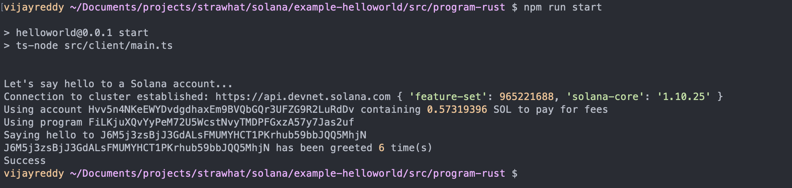

# solana-hello-world

# Hello World Solana program (Smart Contract) in Rust and an off-chain client written in TypeScript to interact with on-chain Rust program .

# Program deployment to the testnet

# Interacting with the program using Ts client

